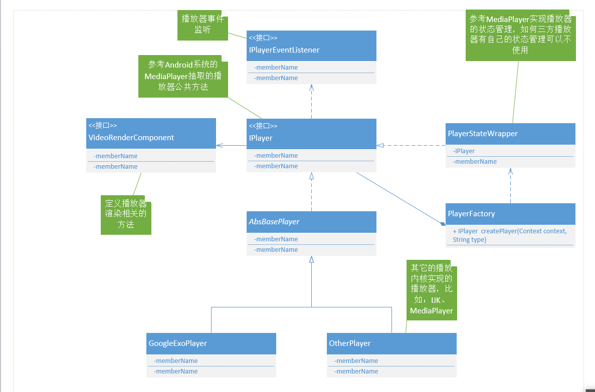
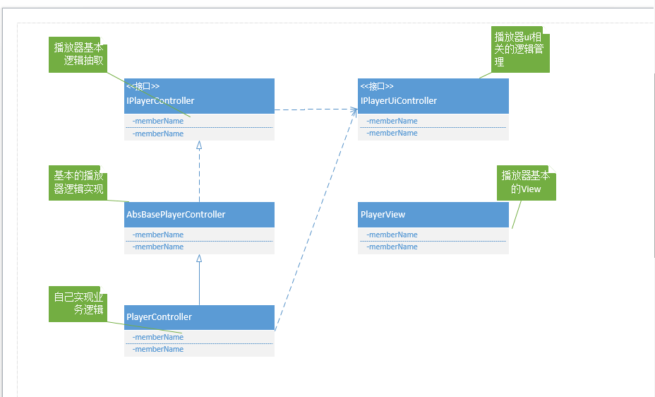

# 播放器模块

播放器作为一个独立的模块进行开发，不包含具体的业务逻辑，

主要解决两个问题：

1. 播放器内核灵活切换
2. 公共的播放模块抽取

**设计目标：**方便多个项目灵活移植

## 内核切换整体设计

**uml类图**

### 关键类说明

**IPlayer：**参考系统MediaPlayer 实现播放器功能抽取，对外暴露为播放器

**GoogleExoPlayer：**以Google的Exo播放器作为内核进行播放

**OtherPlayer:**待扩展的其它播放器内核

**PlayerFactory:**根据不同的需求，创建不同内核的播放器

## 播放器公共逻辑

**uml类图**

